# AI Security using FOSS tools for prompt protection

[](https://github.com/shsingh/ai-sec-lab/blob/main/LICENSE)
[](https://github.com/shsingh/ai-sec-lab/graphs/commit-activity)
[](https://libraries.io/github/shsingh/ai-sec-lab)
[](https://results.pre-commit.ci/latest/github/shsingh/ai-sec-lab/main)
[](https://api.securityscorecards.dev/projects/github.com/shsingh/ai-sec-lab)
[](https://www.bestpractices.dev/projects/15100)

[](https://github.com/shsingh/ai-sec-lab/actions/workflows/ci.yml)
[](https://github.com/shsingh/ai-sec-lab/actions/workflows/dep-contract.yml)
[](https://github.com/shsingh/ai-sec-lab/actions/workflows/dependency-review.yml)
[](https://github.com/shsingh/ai-sec-lab/blob/main/renovate.json)
[](https://github.com/shsingh/ai-sec-lab/actions/workflows/pages.yml)

Live site: https://shsingh.github.io/ai-sec-lab/

A single-node AI prompt-security lab that runs on one Apple-Silicon
MacBook: a Kubernetes Gateway API edge, a policy gate (NOVA + Laya), a
real LLM application, and an attack corpus. The corpus succeeds against
the ungated path and returns 403 through the gated edge.

## Contents

| | Document | Contents |
|---|---|---|
| ▸ | **[INSTALL.md](INSTALL.md)** | one-time setup: OrbStack machine, native Ollama, NixOS convergence |
| ▸ | **[USAGE.md](USAGE.md)** | operation: `nbdev_test`, notebook run order, rule-iteration workflow, publish, tear-down |
| ▸ | **[notebooks/index.ipynb](notebooks/index.ipynb)** | the notebooks' linked table of contents |
| ▸ | **[Guide](https://shsingh.github.io/ai-sec-lab/guide/)** | full reference: architecture, rationale, per-step walkthrough (site; sources in docs/guide/) |
| ▸ | **[PERFORMANCE.md](PERFORMANCE.md)** | measured host/VM resource tuning: model residency, context, keep-alive, pod sizing |
| ▸ | **[SECURITY.md](SECURITY.md)** | vulnerability reporting (email + OpenPGP key, GitHub private reporting), security hygiene: Scorecard, Best Practices, Dependency Review, Dependabot, gitleaks, push protection |
| ▸ | **[CONTRIBUTING.md](CONTRIBUTING.md)** | how to contribute: branch + commit conventions, signing, acceptance suite, a worked example PR |

## Test results

The notebook tests assert four outcomes:

1. **The vulnerability reproduces on the ungated path.** Atlas, the
   customer-support assistant behind the gate, runs a real LLM
   (`gemma4:12b-mlx`). Asked about order 1002, Atlas reads an
   attacker-controlled "support note" in the tool result as instructions
   and copies its (fake) canary API key into a CRM sink. The test asserts
   the canary in the sink log.
2. **Layered evaluation, cheapest first.** Every prompt at the edge is
   evaluated by NOVA's four tiers — keywords (<1 ms), embedding similarity
   (~15 ms), an LLM judge (~200 ms–2 s), then the Laya classifier (~40 ms
   CPU). Cheap tiers short-circuit expensive ones.
3. **The gate blocks the corpus.** The same attacks through the edge
   return 403, the CRM log gains no entries, and each decision is recorded
   in the gate audit log with engine and tier.
4. **The gate passes benign traffic.** Benign prompts return 200 with
   real model completions. A gate that blocked all traffic would satisfy
   every blocking test, so transparency is asserted before the blocking
   tests.

The machine is a NixOS flake, the cluster is OpenTofu, the policy is
`.nov` rule files in Git, and the notebooks are the acceptance tests
(`nbdev_test`).

## Request path

```
curl ──▶ NGINX Gateway Fabric (HTTPRoute, :80)
          └─▶ nova-gate pod
                ├─ NOVA: keywords → semantics → LLM judge   (any match → 403 JSON)
                └─ Laya: typed verdict (injection / jailbreak / benign)
                      └─▶ Atlas pod ──▶ real LLM answer (200)
```

Atlas is also reachable from inside the cluster (`atlas:8080`) without
the gate. The ungated route is what
[05_attacks.ipynb](notebooks/05_attacks.ipynb) tests first: leak on the
ungated path, then 403 on the gated edge.


*Figure 01 — Edge, policy gate, and the vulnerable app. All components FOSS, on one machine.*

## Components

| Component | Function | Runs in | Source |
|---|---|---|---|
| NGINX Gateway Fabric | Gateway API edge — routes inbound `/v1/*` | k3s (NGF controller) | installed by the NixOS module |
| NOVA | prompt screening, 4 evaluator tiers, fail-closed | `nova-gate` pod | [`nova-rules/*.nov`](nova-rules/) |
| Laya | 421M open-weights classifier: injection / jailbreak / benign | `nova-gate` pod | [`gate/app.py`](gate/app.py) |
| Atlas | intentionally vulnerable support assistant — real LLM, tool loop, CRM sink | `atlas` pod | [`gate/victim_app.py`](gate/victim_app.py) |
| Ollama | model host at Metal speed; connects VM to host | macOS host | no configuration |
| OpenTofu | declares all ten cluster objects; `apply` converges | the VM | [`terraform/main.tf`](terraform/main.tf) |
| NixOS flake | declares the machine: k3s, containerd, toolchain | the VM | [`flake.nix`](flake.nix) + [`nixos/configuration.nix`](nixos/configuration.nix) |

**NOVA evaluator tiers:**

| # | Type | Matches | Cost | Depends on |
|---|---|---|---|---|
| 1 | keywords | exact strings + `/regex/i` | <1 ms | core engine |
| 2 | semantics | embedding similarity vs a phrase | ~15 ms | `nova-hunting[semantic]` (MiniLM, ~90 MB, auto) |
| 3 | llm | natural-language judgement question | ~200 ms–2 s | Ollama on the host |
| 4 | decision | Laya classifies the full prompt | ~40 ms CPU | ships with the gate |

One `.nov` rule per tier in [`nova-rules/`](nova-rules/). Rules are plain
text under Git; the notebook tests are the acceptance criteria. Any tier
can block; the engine fails closed.



*Figure 02 — Cheapest tier first; the LLM judge evaluates only prompts that pass the cheaper tiers; Laya is the final classifier.*

## Repository map

```
lab-repo/
├── README.md                  ← architecture and rationale (this file)
├── INSTALL.md                 # one-time setup: machine, models, edge access
├── USAGE.md                   # operation: tests, run order, rule iteration, publish, tear-down
├── flake.nix                  # nixosConfigurations.aisec-lab + devShell + images + tofu wrapper
├── flake.lock                 # nixpkgs pin (generated: nix flake lock)
├── uv.lock                    # the python dependency contract (materialised by uv2nix)
├── pyproject.toml             # declares that contract + the torch CPU index
├── nix/
│   └── images.nix             # container images, built by Nix (not docker)
├── nixos/
│   └── configuration.nix      # k3s + containerd + tools — the machine, declared
├── notebooks/                 # nbdev notebooks — the lab's tests live here
│   ├── index.ipynb            #   linked table of contents
│   ├── 00_core.ipynb          #   constants + cluster connectivity test
│   ├── 01_nova_rules.ipynb    #   the .nov policy — one rule per tier, live-scan tested
│   ├── 02_gate_app.ipynb      #   the gate (NOVA + Laya) + its container image
│   ├── 03_victim.ipynb        #   Atlas — the vulnerable app and its three weaknesses
│   ├── 04_deploy.ipynb        #   OpenTofu: validate → apply → rollouts → first edge probe
│   └── 05_attacks.ipynb       #   the two-path test: leak (direct), block (edge)
├── ai_sec_lab/                # nbdev export target (generated by nbdev_export)
├── gate/
│   ├── app.py                 # FastAPI gate: NOVA (4 tiers) + Laya
│   └── victim_app.py          # Atlas: the intentionally vulnerable support app
├── nova-rules/                # one .nov rule per evaluator tier
├── terraform/
│   └── main.tf                # namespace → configmap → gate → victim → Gateway → HTTPRoute
├── docs/
│   └── guide/                   # the site's split guide pages (what / why / how)
├── assets/mmd/                # mermaid sources + theme config + render script
└── settings.ini               # nbdev config (nbs_path = notebooks)
```

## Design rationale

**Nix + NixOS, the whole toolchain declared.** A security lab must
reproduce identically on another machine. Nix pins the tools (kubectl,
helm, tofu, node — `flake.lock`) *and* the Python packages
(pyproject.toml + `uv.lock` materialised by uv2nix — no pip, no PyPI
drift, no network at shell entry), and the NixOS module declares the
machine: k3s (via `services.k3s` — the cluster's existence is text under
Git), `KUBECONFIG`, the hosts entries. `nixos-rebuild switch` converges a
stock OrbStack VM into the lab. Container images are **built by Nix, not
docker** (`nix/images.nix`): the python closure, the app sources, the
`.nov` rules, and the MiniLM weights (pinned to a Hugging Face repo
revision, hash-verified at build) are layers of a `streamLayeredImage` —
docker/containerd only loads and runs them. OpenTofu runs from the same
flake with a committed provider lock (`.terraform.lock.hcl`). The same
two locks yield an identical environment, image, and plan on another
machine or a CI runner. No setup scripts, no environment drift, no
unpinned layers anywhere.

**NGINX Gateway Fabric at the edge — not an EPP / InferencePool.**
Prompt screening is a security control and must fail closed.
Gateway-API inference extensions (EPP, InferencePool) are load-balancer
machinery and default to `failureMode: FailOpen`: if the pool is
unavailable, traffic passes the check. Screening inside the pool also
means the prompt has already entered the cluster — flow established,
metrics exposed, session state spent. The edge blocks with a 403 before
any of that exists, and keeps policy decoupled from the serving path's
release cycle.



*Figure 03 — Fail-closed edge enforcement vs in-pool screening.*

**A vulnerable application, not a simulator.** Gate tests against a
simulated LLM establish only that strings are blocked, not that the
attack succeeds. Atlas runs a real model with a real tool loop
([03_victim](notebooks/03_victim.ipynb) documents its three weaknesses),
so the ungated path first demonstrates the leak, and the gated path then
demonstrates the block.

**Model selection.** Each model is the smallest that meets the
requirement:

- `llama3.2:3b` — NOVA LLM-tier judge: ~200 ms–2 s per judgement on the
  Mac's GPU.
- `gemma4:12b-mlx` — the victim's engine: supports multi-turn tool loops;
  ~8 GB so the lab fits on one machine; MLX build for Metal acceleration.
- Laya — 421M open-weights classifier: typed injection / jailbreak /
  benign verdict in one CPU pass, catching patterns absent from the
  rule tiers.
- `all-MiniLM-L6-v2` — ~90 MB embedding model for the semantics tier;
  pinned to a HF repo revision and hash-verified, pre-baked into the gate
  image by the flake.

**Notebooks / nbdev.** Code, tests, prompts, and documentation in one
place: `nbdev_test` runs the acceptance suite; each markdown cell
describes the following cell's function and expected output; `nbdev_docs`
publishes the set as a static site. The notebooks are the source of
truth; `gate/`, `terraform/`, and `nova-rules/` are generated from them
and committed, so artifacts and notebooks cannot diverge. The artifacts
are runtime-agnostic: moving hosts changes where they run, not what they
are.

*This project came out of following Jeremy Howard's work and wanting to
try nbdev after his ["I Like Notebooks"
talk](https://www.youtube.com/watch?v=9Q6sLbz37gk).*

## Deployment model

**OrbStack Linux VMs get no GPU.** OrbStack runs Linux machines on
Apple's Virtualization.framework, which provides no GPU/Metal access to
guests — containerized inference in the VM is CPU-only, 3–6× slower than
native on Apple Silicon (measured on 8B-class models). The lab is
therefore split at one boundary:

- **macOS host (Metal):** Ollama — the LLM-tier judge (`llama3.2:3b`) and
  the victim's engine (`gemma4:12b-mlx`), at native GPU speed. Nothing
  else runs on the host.
- **NixOS VM (`aisec-lab`):** k3s, NGINX Gateway Fabric, the nova-gate
  pod (NOVA + Laya, CPU), the Atlas app, and the toolchain — declared in
  `flake.nix` + `nixos/configuration.nix`.

The gate pod reaches Ollama at `host.orb.internal:11434` (OrbStack DNS,
OpenAI-compatible endpoint). All model traffic stays on the machine; no
external API keys.

## Constraints and limitations

- Laya zero-shot is weak — fine-tune for production use (the project
  ships a Kaggle notebook). Its outputs are probabilities; benchmark
  thresholds on your own traffic before depending on them.
- Latency adds by tier — keywords <1 ms, semantics ~15 ms, the LLM tier
  ~200 ms–2 s per judged prompt. The condition logic short-circuits, so
  cheap tiers run first.
- The victim's canary key is fake, but the failure it models is real: an
  assistant that carries credentials in its system prompt and can be
  directed to write them to an integrated sink.
- A 12B aligned model sometimes refuses the poisoned note; the gate's
  fail-closed verdict does not. Model-level resistance varies between
  runs.
- **The gate screens the prompt channel only.** The poisoned RAG note in
  the victim is an *indirect* injection — attacker text in a tool result —
  which prompt screening does not see. This is why the direct-path test
  exists, and why a production gate must also screen tool/RAG traffic;
  out of scope here.
- Nova/Laya versions change frequently — pin them in `pyproject.toml`/
  `uv.lock` and bump between lab runs, never mid-run; dep-contract CI
  fails a bump that breaks the lab.
- k3s runs with default sandboxing; the gate pod's 2–5Gi limits assume
  the VM has ≥8 GB.

## License

MIT — see [LICENSE](LICENSE).
