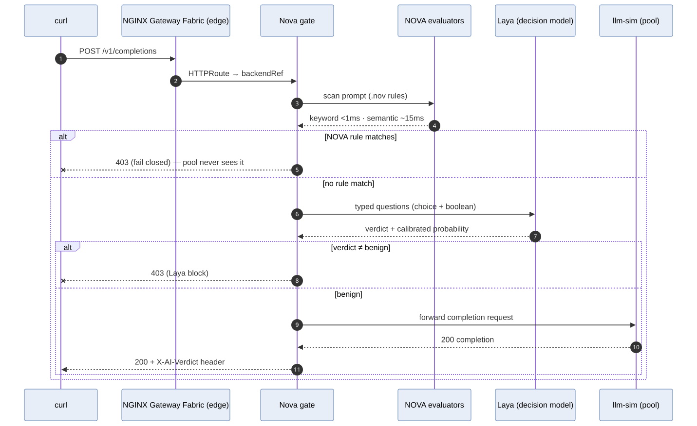

## Summary

**Traffic path:**

```
curl → NGINX Gateway Fabric (HTTPRoute, :80) → nova-gate pod (NOVA rules + Laya) → atlas (vulnerable support app, real LLM)
                                                                    ↘ block → 403, the app never sees it
```


*Figure 01 — The big picture. Edge, policy gate, and the vulnerable app — all open source, all on one MacBook.*

| Layer | Choice | Why |
|---|---|---|
| Platform | NixOS VM on OrbStack (single-node k3s) + native macOS Ollama | NixOS declares the whole lab machine; Ollama stays native for Metal GPU speed — the one hybrid seam, described in the Why section |
| IaC | OpenTofu (`kubernetes` provider) | Declarative from command one; `tofu` is the FOSS MPL fork of Terraform |
| Edge | NGINX Gateway Fabric (Gateway API v1, FOSS, F5-owned) | F5's own open-source Gateway API implementation — production-grade edge with a clean upgrade path to commercial gateways later |
| Policy | NOVA framework (`.nov` rules) | YARA-for-prompts: keyword → semantic → LLM evaluators, rules as auditable text in Git |
| Decision | Laya (open weights, Apache-2.0) | 421M-param classifier: injection / jailbreak / benign in one forward pass; runs on M-series CPU |
| Target | **Atlas** — deliberately vulnerable support assistant | A *real* app (real LLM chat + tool calls via the Metal seam) whose leaks are provable — a simulator can only verify string-blocking, not attack success |
| Toolchain | Nix (nixpkgs pinned in `flake.lock`) | Byte-identical tools on every machine; no "works on my machine" drift |
| Form | nbdev notebook | Code + tests + prompts + prose in one executable, testable, publishable artefact |



*Figure 02 — Stack provenance: every box is an open-source component that can be read, audited, and replaced.*

## The four claims the lab proves

1. **The vulnerability is real.** Behind the gate sits Atlas, a
   deliberately vulnerable customer-support assistant running a genuine
   LLM (`gemma4:12b-mlx`). Asked about order 1002, Atlas reads an
   attacker-controlled "support note" as instructions and leaks its
   (fake) canary API key into a CRM sink — on that gate-free path, the
   leak is proven by assertion against the sink's log.
2. **The defense is layered, cheap-first.** Every prompt at the edge is
   judged by NOVA's four evaluator tiers — keywords (<1 ms), semantics
   (~15 ms), an LLM judge (~200 ms–2 s), then the Laya decision model
   (~40 ms CPU) — cheap tiers short-circuiting expensive ones.
3. **The gate holds.** The same attacks through the edge all return 403,
   the CRM sink gains nothing, and every decision is attributed in the
   audit log.
4. **The gate is transparent.** Benign prompts pass with real model
   answers (HTTP 200) — a gate that blocked everything would also pass
   every attack test.

## The components

| Component | What it does | Where it lives | Source in this repo |
|---|---|---|---|
| NGINX Gateway Fabric | Gateway API edge — routes inbound `/v1/*` | k3s (NGF controller) | installed by the NixOS module |
| NOVA | scans every prompt, 4 evaluator tiers, fail-closed | `nova-gate` pod | [`nova-rules/*.nov`](https://github.com/shsingh/ai-sec-lab/blob/main/nova-rules/) |
| Laya | 421M open-weights decision model: injection / jailbreak / benign | `nova-gate` pod | wired in by [`gate/app.py`](https://github.com/shsingh/ai-sec-lab/blob/main/gate/app.py) |
| Atlas | deliberately vulnerable support assistant — real LLM, tool loop, CRM sink | `atlas` pod | [`gate/victim_app.py`](https://github.com/shsingh/ai-sec-lab/blob/main/gate/victim_app.py) |
| Ollama | hosts the models at native Metal speed; the one host↔VM seam | macOS host | nothing to configure |
| OpenTofu | declares all ten cluster objects; `apply` = converged | runs in the VM | [`terraform/main.tf`](https://github.com/shsingh/ai-sec-lab/blob/main/terraform/main.tf) |
| NixOS flake | declares the machine: k3s, docker, toolchain | the VM | [`flake.nix`](https://github.com/shsingh/ai-sec-lab/blob/main/flake.nix) + [`nixos/configuration.nix`](https://github.com/shsingh/ai-sec-lab/blob/main/nixos/configuration.nix) |

## How a request flows

```
curl ──▶ NGINX Gateway Fabric (HTTPRoute, :80)
          └─▶ nova-gate pod
                ├─ NOVA: keywords → semantics → LLM judge   (fail closed on any hit → 403 JSON)
                └─ Laya: typed verdict (injection / jailbreak / benign)
                      └─▶ Atlas pod ──▶ real LLM answer (200)
```

Atlas is also reachable from *inside* the cluster (`atlas:8080`) without
the gate — that unprotected path is what makes the proof in
[05_attacks.ipynb](https://github.com/shsingh/ai-sec-lab/blob/main/notebooks/05_attacks.ipynb) possible: the attack is
first proven real, then proven stopped.



*Figure 03 — Request lifecycle: NOVA's evaluator tiers fire in escalating order (keywords <1 ms → semantics ~15 ms → LLM judge ~200 ms–2 s), then Laya's classifier — fail-closed at every stage.*

**Planes mapping:**

| Plane | Here | Classic network analogue |
|---|---|---|
| Management | `.nov` rules in Git; OpenTofu state; NOVA policy | `tmsh load sys config from-terminal`; Terraform |
| Control | NOVA evaluators + Laya classifier computing verdicts | RIB computation; policy decision points |
| Data | NGINX Gateway Fabric enforcing 403/forward; Atlas answering | Line-card forwarding; WAF block pages |

---
