## Nix and NixOS

A security lab must reproduce identically on another machine. Nix pins the entire toolchain (kubectl, helm,
tofu, python, node — `flake.lock`), and the NixOS module declares the
*machine* itself: k3s (via `services.k3s`, not a GUI toggle — the
cluster's existence is reviewable text in Git like everything else),
docker for image builds, `KUBECONFIG`, the hosts entries. One
`nixos-rebuild switch` converges a fresh OrbStack machine into a working
lab; the same `flake.lock` gives any colleague or CI runner a
byte-identical environment. No setup scripts to drift, no "works on my
machine".

## NGINX Gateway Fabric at the edge

Prompt screening is a security control, and a security control must fail
closed. Gateway-API inference extensions (EPP, InferencePool) are
load-balancer machinery and default to `failureMode: FailOpen` — if the
pool is unavailable, traffic flows *past* the check. Screening inside
the pool also means the prompt has already entered the cluster: flow
established, metrics exposed, session state spent. NGF at the edge
blocks with a 403 before any of that exists, and keeps policy decoupled
from the serving path's version churn — the same reason a WAF sits in
front of the app, not inside it.

*Figure 04 — The placement argument in one picture: fail-closed edge enforcement beats in-pool screening.*

## A vulnerable application, not a simulator

Gate tests against a
simulated LLM establish only that strings are blocked, not that the
attack succeeds. Atlas runs a real model with a real tool loop, so the
ungated path first demonstrates the leak, and the gated path then
demonstrates the block.

## Model selection

Each model is the smallest tool that does
its job:

| Role | Model | Size | Why this one |
|---|---|---|---|
| NOVA LLM-tier judge | `llama3.2:3b` | ~2 GB | Reads intent in ~200 ms–2 s per judgement on the Mac's GPU |
| Atlas engine | `gemma4:12b-mlx` | ~8 GB | Behaves like a real assistant (multi-turn tool loop, instruction following); MLX build = native Metal speed |
| NOVA semantics tier | `all-MiniLM-L6-v2` | ~90 MB | Automatic on first scan; pre-baked into the gate image at build time |
| Laya decision model | (bundled with `laya[serve]`) | ~808 MB | Typed injection/jailbreak/benign verdict, one CPU forward pass; loads on gate-container boot |

The entire defence stack is local, air-gap-capable, and costs $0/token.

## Notebooks and nbdev

Code, tests, prompts, and prose in
one place — `nbdev_test` is the lab's acceptance suite; each markdown cell states the following
cell's function and expected output;
`nbdev_docs` publishes the set as a static site. The
notebooks are the source of truth; `gate/`, `terraform/`, and
`nova-rules/` are generated from them and committed, so artifacts and
notebooks cannot diverge — and the artifacts themselves stay
runtime-agnostic: moving hosts changes where they run, not what they are.

## The hybrid constraint

An
OrbStack Linux machine runs on Apple's Virtualization.framework, which
exposes no GPU/Metal to guests — containerized inference in the VM is
CPU-only, 3–6× slower than native on Apple Silicon (measured publicly on
8B-class models). So the lab is hybrid, with exactly one seam:

- **macOS host (native, Metal):** Ollama — the LLM-tier judge
  (`llama3.2:3b`) and the victim's engine (`gemma4:12b-mlx`), at full GPU
  speed. Nothing else lives on the Mac.
- **NixOS VM (`aisec-lab`):** k3s cluster, NGINX Gateway Fabric edge, the
  nova-gate pod (NOVA + Laya, CPU), the Atlas victim app, and the whole
  lab toolchain — all declared in `flake.nix` + `nixos/configuration.nix`.

The gate pod reaches native Ollama over `host.orb.internal:11434`
(OrbStack DNS, OpenAI-compatible endpoint). Everything stays on the
MacBook; no cloud keys anywhere — no external API keys are involved at any point.

*Figure 05 — Toolchain: the flake pins every tool and the NixOS module declares the machine — one path, no drift.*

## Known limits

- Laya zero-shot is weak — fine-tune for production (the project ships a
  Kaggle fine-tuning notebook). Its verdicts are probabilities, not
  verdicts; benchmark the judge on your own corpus before trusting
  thresholds.
- Latency stacks by tier — keywords <1 ms, semantics ~15 ms, the LLM
  tier adds ~200 ms–2 s per judged prompt. That is why the condition
  logic short-circuits: cheap stages run first.
- The victim's canary key is fake by design, but it models the real
  failure: an assistant that carries credentials in its system prompt and
  can be steered into writing them to an integrated sink.
- Model-level resistance is probabilistic — a 12B aligned model may
  sometimes refuse the poisoned note. The gate's fail-closed verdict is
  not probabilistic; the gate's verdict is deterministic while the model's is not.
- **The gate scans the prompt channel only.** Atlas's poisoned RAG note
  is an *indirect* injection — attacker-controlled text arriving in a
  tool result, not a user prompt — so prompt screening cannot see it.
  That is why the direct-path proof exists, and why a production gate
  must also screen tool/RAG traffic: out of scope here, stated so the
  boundary is explicit.
- Nova/Laya versions move fast — pin them in `flake.nix` /
  `requirements-dev.txt` and bump deliberately between lab runs, never
  mid-run.
- The VM's k3s runs with default sandboxing; the gate pod's 2–5Gi memory
  limits assume the VM gets ≥8 GB.

---
