[](https://github.com/shsingh/ai-sec-lab/blob/main/LICENSE)
[](https://github.com/shsingh/ai-sec-lab/graphs/commit-activity)
[](https://libraries.io/github/shsingh/ai-sec-lab)
[](https://results.pre-commit.ci/latest/github/shsingh/ai-sec-lab/main)
[](https://api.securityscorecards.dev/projects/github.com/shsingh/ai-sec-lab)

A single-node AI prompt-security lab that runs on one Apple-Silicon
MacBook: a Kubernetes Gateway API edge, a policy gate (NOVA + Laya), a
real LLM application, and an attack corpus. The corpus succeeds against
the ungated path and returns 403 through the gated edge.



## Contents

| | Page | Contents |
|---|---|---|
| ▸ | **[Notebooks](docs/notebooks.qmd)** | the lab's linked table of contents — start the click-through here |
| ▸ | **[Install](docs/installation.qmd)** | one-time setup: OrbStack machine, native Ollama, NixOS convergence |
| ▸ | **[Usage](docs/usage.qmd)** | operation: `nbdev_test`, notebook run order, rule-iteration workflow, publish, tear-down |
| ▸ | **[Guide](docs/guide/index.qmd)** | architecture, design rationale, per-cell walkthrough |
| ▸ | **[Performance](docs/performance.qmd)** | measured host/VM resource tuning: model residency, context, keep-alive, pod sizing |

The repository README carries the same content in repository form;
[browse the repo](https://github.com/shsingh/ai-sec-lab) for source,
notebooks, and CI.

## Request path

```
curl ──▶ NGINX Gateway Fabric (HTTPRoute, :80)
          └─▶ nova-gate pod
                ├─ NOVA: keywords → semantics → LLM judge   (any match → 403 JSON)
                └─ Laya: typed verdict (injection / jailbreak / benign)
                      └─▶ Atlas pod ──▶ real LLM answer (200)
```

Atlas is also reachable from inside the cluster (`atlas:8080`) without
the gate. The ungated route is what the attack notebook tests first:
leak on the ungated path, then 403 on the gated edge.

## The four claims the lab proves

1. **The vulnerability reproduces on the ungated path.** Atlas, the
   customer-support assistant behind the gate, runs a real LLM
   (`gemma4:12b-mlx`). Asked about order 1002, Atlas reads an
   attacker-controlled "support note" in the tool result as instructions
   and copies its (fake) canary API key into a CRM sink. The test asserts
   the canary in the sink log.
2. **Layered evaluation, cheapest first.** NOVA's four tiers — keywords
   (<1 ms), embedding similarity (~15 ms), an LLM judge (~200 ms–2 s),
   then the Laya classifier (~40 ms CPU); cheap tiers short-circuit
   expensive ones.
3. **The gate blocks the corpus.** Every attack through the edge returns
   403, the CRM log gains no entries, and each decision is recorded in
   the gate audit log with engine and tier.
4. **The gate passes benign traffic.** Benign prompts return 200 with
   real model completions — asserted before the blocking tests, because a
   gate that blocked everything would satisfy every blocking test.

Everything is FOSS and declarative: the machine is a NixOS flake, the
cluster is OpenTofu, the policy is `.nov` rule files in Git, and the
notebooks are the acceptance tests (`nbdev_test`).
